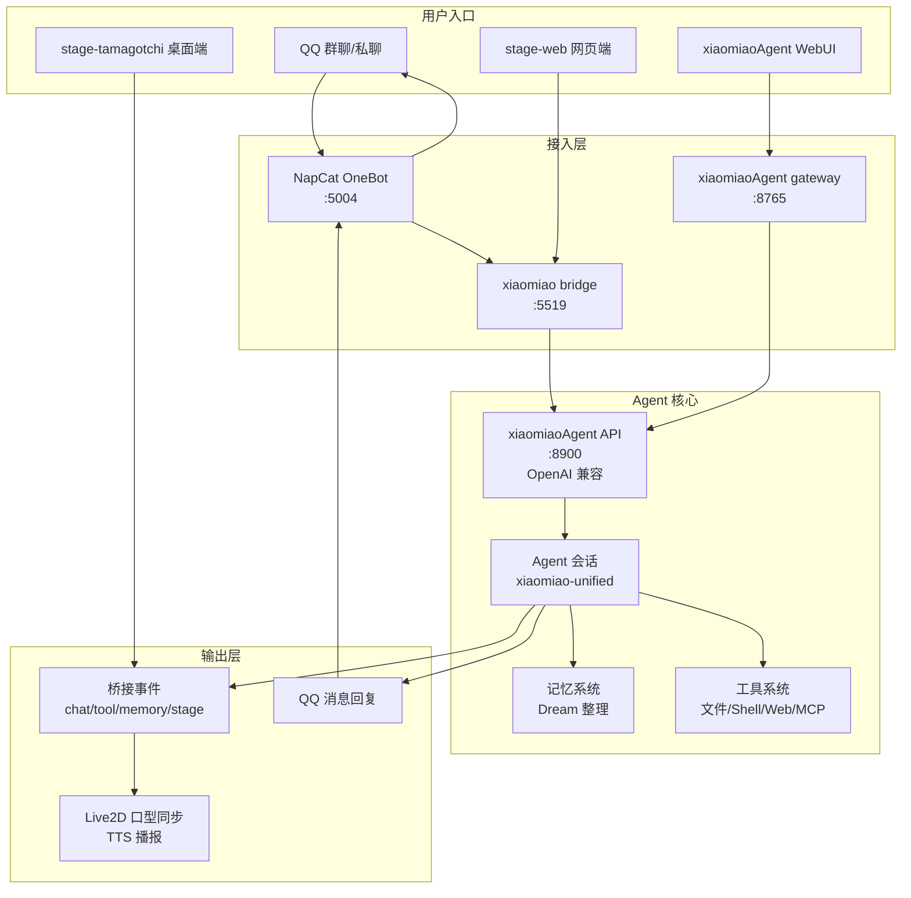
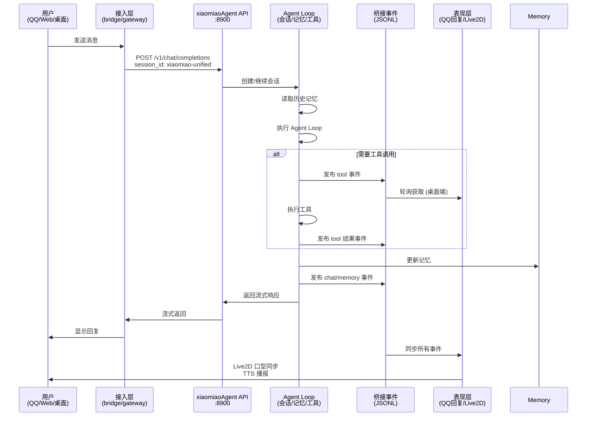
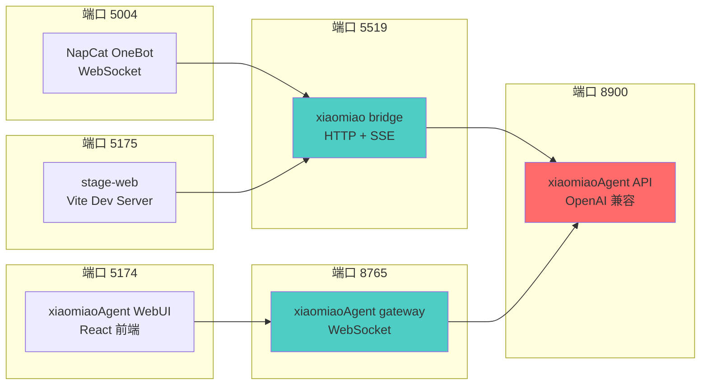

# 项目覆盖图

`xiaomiaoVirtual` 是 QQ 机器人、Vtuber 表现层和轻量 Agent 框架的整合项目。当前主链路是：QQ、网页端、桌面端和 xiaomiaoAgent WebUI 共享统一 Agent 会话、工具权限和桥接事件。

## 系统架构图



## 统一 Agent 链路流程图



## 端口和服务依赖图



## 根目录

| 路径 | 说明 |
|------|------|
| `README.md` | 项目根说明和能力概览 |
| `TECHNICAL.md` | 技术架构、桥接协议和风险分析 |
| `.github/` | GitHub 配置目录，当前不是运行主链路 |
| `.learnings/` | 本地错误记录和经验沉淀 |
| `.understand-anything/` | Understand Anything 本地知识图谱与仪表盘运行产物，不提交运行态结果 |
| `config.json` | 本机私有模型和 Agent 统一配置，不提交 |
| `config.example.json` | 配置模板 |
| `open-understand-dashboard.cmd` / `open-understand-dashboard.ps1` | 打开本地 Understand Anything 项目图谱仪表盘 |
| `setup-env.cmd` | 首次安装/修复环境脚本 |
| `start-all.cmd` | 一键启动脚本 |
| `scripts/start-all-health.ps1` | 一键启动健康检查脚本 |
| `workspace/` | 对话下载资源、生成物和临时文件目录 |
| `test/` | 项目根 Python 测试 |
| `tool/` | 第三方工具源码和接入评估 |
| `docs/` | 本项目统一中文文档 |
| `xiaomiaoVirtual/` | 历史/嵌套目录，当前主链路不依赖 |

## 核心子系统

| 子系统 | 路径 | 职责 |
|--------|------|------|
| QQ 机器人 | `xiaomiao/` | 连接 NapCat / OneBot，处理 QQ 消息、权限、命令、文件下载和 Agent 调用 |
| Agent 框架 | `xiaomiaoAgent/` | 提供 Agent Loop、OpenAI 兼容 API、网关、WebUI、工具、记忆和 MCP |
| Web / 桌面表现层 | `xiaomiaobot/` | 提供 stage-web、stage-tamagotchi、stage-pocket、Live2D / VRM、TTS 和插件服务 |
| 工具目录 | `tool/` | 保存 MarkItDown、Scrapling 等工具源码和接入材料 |
| 运行工作区 | `workspace/` | 保存 QQ 下载文件、转换产物、临时文件和本地生成物 |

## 统一运行链路

```text
QQ / stage-web / stage-tamagotchi / xiaomiaoAgent WebUI
    ↓
xiaomiao bridge 或 xiaomiaoAgent gateway
    ↓
xiaomiaoAgent API :8900
    ↓
Agent 会话 / 记忆 / 工具 / MCP
    ↓
QQ 回复 + bridge event + Web/桌面同步
```

## 端口

| 端口 | 服务 |
|------|------|
| `5004` | NapCat OneBot WebSocket |
| `5519` | xiaomiao bridge |
| `8900` | xiaomiaoAgent OpenAI 兼容 API |
| `8765` | xiaomiaoAgent gateway |
| `5175` | xiaomiaobot stage-web |
| `5174` | xiaomiaoAgent WebUI |

## 权限边界

| 范围 | 默认策略 |
|------|----------|
| 普通 QQ 用户 | 只能使用低风险 Agent 工具 |
| ROOT / Super / Agent 工具白名单 | 可触发高风险请求确认 |
| 本机命令、写文件、MCP 动作 | 必须确认后执行 |
| QQ 下载文档 | 保存到 `workspace/downloads/qq/`，作为不可信内容处理 |
| 网页抓取 | 只允许公网 HTTP / HTTPS，阻断本机和内网地址 |

## 已覆盖文档

| 范围 | 文档 |
|------|------|
| 文档总入口 | `docs/README.md` |
| 启动与配置 | `docs/run-and-config.md`、`docs/STARTUP.md` |
| 项目深度分类 | `docs/project-deep-classification.md` |
| 根脚本和配置 | `docs/scripts-and-config.md` |
| 验证矩阵 | `docs/verification.md` |
| 测试目录和质量边界 | `docs/testing-and-quality.md` |
| QQ 指令 | `docs/QQ机器人指令速查.md` |
| 文件工作区 | `docs/file-workspace-hygiene.md` |
| MCP 和外部服务 | `docs/mcp-and-external-services.md` |
| Bridge Event | `docs/bridge-events.md` |
| xiaomiao QQ 机器人 | `docs/xiaomiao/README.md` |
| xiaomiaoAgent | `docs/xiaomiaoAgent/README.md` |
| xiaomiaobot 表现层 | `docs/xiaomiaobot/README.md`、`docs/xiaomiaobot/services-and-plugins.md`、`docs/xiaomiaobot/struct.md` |
| tool 目录 | `docs/tool/tool-directory-analysis.md` |
| 开发维护 | `docs/development-maintenance.md` |
| 计划书索引 | `docs/plans/README.md` |

## 后续可扩展内容

| 范围 | 建议 |
|------|------|
| `tool/markitdown` | 补独立使用手册，说明 QQ 文档转 Markdown 的调用链和格式边界 |
| `tool/Scrapling` | 补独立使用手册，说明网页抓取、反爬限制和本机地址阻断 |
| `xiaomiaobot/services` | 深入拆解 server-runtime、TTS、舞台动作和插件服务 |
| MCP 外部服务真实联调 | 在已有配置说明基础上补各服务启动、鉴权和故障排查 |
| `docs/plans` | 对计划书按“已完成、进行中、待拆分”归档，便于持续推进 |
