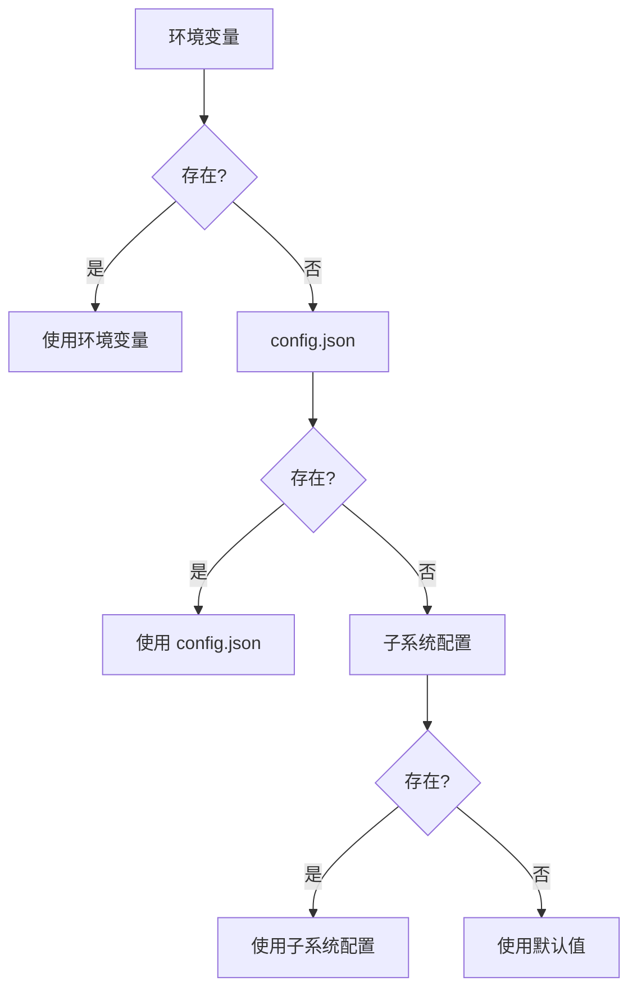

# 配置文件示例

**版本**: v1.0  
**更新日期**: 2026-06-24

本文档提供 xiaomiaoVirtual 的完整配置示例和说明。

---

## 📋 目录

1. [最小配置](#最小配置)
2. [完整配置](#完整配置)
3. [开发环境配置](#开发环境配置)
4. [生产环境配置](#生产环境配置)
5. [常见配置场景](#常见配置场景)

---

## 最小配置

### 主配置文件 (config.json)

**位置**: `F:\xiaomiaoVirtual\config.json`

```json
{
  "nanobot": {
    "provider": "custom",
    "model": "deepseek-v4-flash",
    "providers": {
      "custom": {
        "apiKey": "sk-your-api-key-here",
        "baseUrl": "https://api.example.com/v1"
      }
    }
  },
  "nanobot_agent": {
    "enabled": true,
    "base_url": "http://127.0.0.1:8900/v1/chat/completions",
    "model": "",
    "session_id": "xiaomiao-unified",
    "timeout_seconds": 30
  }
}
```

**说明**:
- ✅ 适合：仅使用 TUI 终端模式
- ✅ 需要：API Key 和中转站地址
- ❌ 不包括：QQ Bot 配置

---

## 完整配置

### 1. 主配置文件 (config.json)

```json
{
  "nanobot": {
    "provider": "custom",
    "model": "deepseek-v4-flash",
    "providers": {
      "custom": {
        "apiKey": "sk-your-api-key-here",
        "baseUrl": "https://api.example.com/v1"
      },
      "openai": {
        "apiKey": "sk-your-openai-key",
        "baseUrl": "https://api.openai.com/v1"
      }
    },
    "temperature": 0.7,
    "max_tokens": 4096
  },
  "nanobot_agent": {
    "enabled": true,
    "base_url": "http://127.0.0.1:8900/v1/chat/completions",
    "model": "",
    "session_id": "xiaomiao-unified",
    "timeout_seconds": 30
  }
}
```

### 2. QQ Bot 配置 (xiaomiao/config.json)

```json
{
  "ROOT": "123456789",
  "Super": ["987654321"],
  "agent_tool_allowlist": ["111222333"],
  "onebot": {
    "ws_url": "ws://127.0.0.1:5004"
  },
  "bot_qq": "你的机器人QQ号",
  "command_prefix": "",
  "enable_group_chat": true,
  "enable_private_chat": true,
  "reply_on_mention": true,
  "system_prompt": "你是小喵，一个可爱的AI助手。"
}
```

### 3. xiaomiaoAgent 配置 (.nanobot/config.json)

```json
{
  "model": "deepseek-v4-flash",
  "provider": "custom",
  "providers": {
    "custom": {
      "apiKey": "sk-your-api-key-here",
      "baseUrl": "https://api.example.com/v1"
    }
  },
  "tools": {
    "enabled": [
      "markitdown_convert",
      "scrapling_get",
      "web_search"
    ],
    "mcp_servers": []
  },
  "memory": {
    "enabled": true,
    "max_history": 50
  }
}
```

**说明**:
- ✅ 适合：完整功能使用（QQ Bot + Web + Agent）
- ✅ 包括：权限配置、工具配置、记忆配置

---

## 开发环境配置

### 主配置 (config.json)

```json
{
  "nanobot": {
    "provider": "custom",
    "model": "deepseek-v4-flash",
    "providers": {
      "custom": {
        "apiKey": "sk-dev-api-key",
        "baseUrl": "https://api-dev.example.com/v1"
      }
    },
    "temperature": 0.3,
    "max_tokens": 2048,
    "stream": true
  },
  "nanobot_agent": {
    "enabled": true,
    "base_url": "http://127.0.0.1:8900/v1/chat/completions",
    "model": "",
    "session_id": "dev-session",
    "timeout_seconds": 60
  },
  "debug": true,
  "log_level": "DEBUG"
}
```

### QQ Bot 配置 (xiaomiao/config.json)

```json
{
  "ROOT": "你的开发QQ号",
  "Super": [],
  "agent_tool_allowlist": ["你的开发QQ号"],
  "onebot": {
    "ws_url": "ws://127.0.0.1:5004"
  },
  "enable_group_chat": false,
  "enable_private_chat": true,
  "debug_mode": true,
  "log_all_messages": true
}
```

**特点**:
- 🔧 调试模式开启
- 📊 详细日志
- 🔒 仅私聊启用（安全）
- ⏱️ 更长超时时间

---

## 生产环境配置

### 主配置 (config.json)

```json
{
  "nanobot": {
    "provider": "custom",
    "model": "deepseek-v4-flash",
    "providers": {
      "custom": {
        "apiKey": "sk-prod-api-key",
        "baseUrl": "https://api.example.com/v1"
      }
    },
    "temperature": 0.7,
    "max_tokens": 4096,
    "stream": true,
    "retry_times": 3,
    "retry_delay": 2
  },
  "nanobot_agent": {
    "enabled": true,
    "base_url": "http://127.0.0.1:8900/v1/chat/completions",
    "model": "",
    "session_id": "prod-unified",
    "timeout_seconds": 30
  },
  "debug": false,
  "log_level": "INFO"
}
```

### QQ Bot 配置 (xiaomiao/config.json)

```json
{
  "ROOT": "管理员QQ号",
  "Super": ["超级用户1", "超级用户2"],
  "agent_tool_allowlist": ["信任用户1", "信任用户2"],
  "onebot": {
    "ws_url": "ws://127.0.0.1:5004"
  },
  "enable_group_chat": true,
  "enable_private_chat": true,
  "rate_limit": {
    "enabled": true,
    "max_requests_per_minute": 10,
    "max_requests_per_hour": 100
  },
  "blacklist": [],
  "whitelist_groups": []
}
```

**特点**:
- 🔐 严格权限控制
- 🚦 请求频率限制
- 📝 INFO 级别日志
- 🔄 自动重试机制

---

## 常见配置场景

### 场景 1: 仅本地 TUI 使用

**需要的配置**:
- ✅ `config.json` - 主配置
- ❌ `xiaomiao/config.json` - 不需要
- ❌ NapCat - 不需要

**启动命令**:
```powershell
start-tui.cmd
```

---

### 场景 2: QQ Bot + TUI

**需要的配置**:
- ✅ `config.json` - 主配置
- ✅ `xiaomiao/config.json` - QQ Bot 配置
- ✅ NapCat - 需要

**启动命令**:
```powershell
start-all.cmd
```

**关键配置点**:
```json
// xiaomiao/config.json
{
  "ROOT": "你的QQ号",  // 必填
  "onebot": {
    "ws_url": "ws://127.0.0.1:5004"  // 确保端口正确
  }
}
```

---

### 场景 3: Web 界面 + Live2D

**需要的配置**:
- ✅ `config.json` - 主配置
- ✅ `xiaomiao/config.json` - 桥接配置
- ✅ Node.js 依赖

**启动命令**:
```powershell
start-all.cmd
```

**访问地址**:
- Web 界面: http://127.0.0.1:5175

---

### 场景 4: 多模型配置

```json
{
  "nanobot": {
    "provider": "custom",
    "model": "deepseek-v4-flash",
    "providers": {
      "custom": {
        "apiKey": "sk-custom-key",
        "baseUrl": "https://api.custom.com/v1"
      },
      "openai": {
        "apiKey": "sk-openai-key",
        "baseUrl": "https://api.openai.com/v1"
      },
      "claude": {
        "apiKey": "sk-claude-key",
        "baseUrl": "https://api.anthropic.com/v1"
      }
    }
  }
}
```

**切换模型**:
修改 `nanobot.provider` 和 `nanobot.model` 字段，重启服务生效。

---

### 场景 5: 启用 MCP 工具

```json
{
  "nanobot": {
    "provider": "custom",
    "model": "deepseek-v4-flash",
    "providers": {
      "custom": {
        "apiKey": "sk-your-key",
        "baseUrl": "https://api.example.com/v1"
      }
    }
  },
  "mcp_servers": {
    "computer-use": {
      "enabled": false,
      "config": {
        "display_width": 1920,
        "display_height": 1080
      }
    },
    "twitter": {
      "enabled": false,
      "config": {}
    }
  }
}
```

**安全提示**:
- ⚠️ Computer Use 和 Twitter MCP 默认关闭
- ⚠️ 启用前阅读 [mcp-and-external-services.md](../02-architecture/mcp-and-external-services.md)
- ⚠️ 仅在受信任环境中启用

---

## 配置优先级



**优先级顺序**（从高到低）:
1. 环境变量 (如 `NANOBOT_API_KEY`)
2. 主配置文件 (`config.json`)
3. 子系统配置文件 (`xiaomiao/config.json`, `xiaomiaoAgent/.nanobot/config.json`)
4. 默认值

---

## 配置验证

### 检查配置是否有效

```powershell
# 检查主配置
python -c "import json; print(json.load(open('config.json')))"

# 检查 QQ Bot 配置
python -c "import json; print(json.load(open('xiaomiao/config.json')))"

# 启动前检查
start-all.cmd --check
```

### 常见配置错误

#### 错误 1: API Key 无效
```
❌ 错误信息: "Unauthorized" 或 "Invalid API Key"
✅ 解决: 检查 config.json 中的 apiKey 是否正确
```

#### 错误 2: 端口被占用
```
❌ 错误信息: "Address already in use"
✅ 解决: 
netstat -ano | findstr "端口号"
taskkill /PID <进程ID> /F
```

#### 错误 3: 配置文件格式错误
```
❌ 错误信息: "JSONDecodeError"
✅ 解决: 使用 JSON 校验器检查语法
在线工具: https://jsonlint.com/
```

#### 错误 4: QQ Bot 连接失败
```
❌ 错误信息: "WebSocket connection failed"
✅ 解决: 
1. 检查 NapCat 是否运行
2. 检查 ws_url 端口是否正确 (默认 5004)
3. 检查防火墙设置
```

---

## 配置模板

### 快速生成配置

```powershell
# 复制配置模板
cp config.example.json config.json
cp xiaomiao/config.example.json xiaomiao/config.json

# 编辑配置（使用你喜欢的编辑器）
notepad config.json
notepad xiaomiao/config.json
```

---

## 📚 相关文档

- [配置说明](../01-configuration/configuration.md) - 详细配置文档
- [快速启动](../00-quick-start/run-and-config.md) - 启动指南
- [故障排查](../01-configuration/troubleshooting.md) - 配置问题排查

---

**更新日志**:
- v1.0 (2026-06-24) - 初始版本，包含 5 种配置场景

**需要帮助？** 查看 [故障排查文档](../01-configuration/troubleshooting.md) 或提 Issue。
