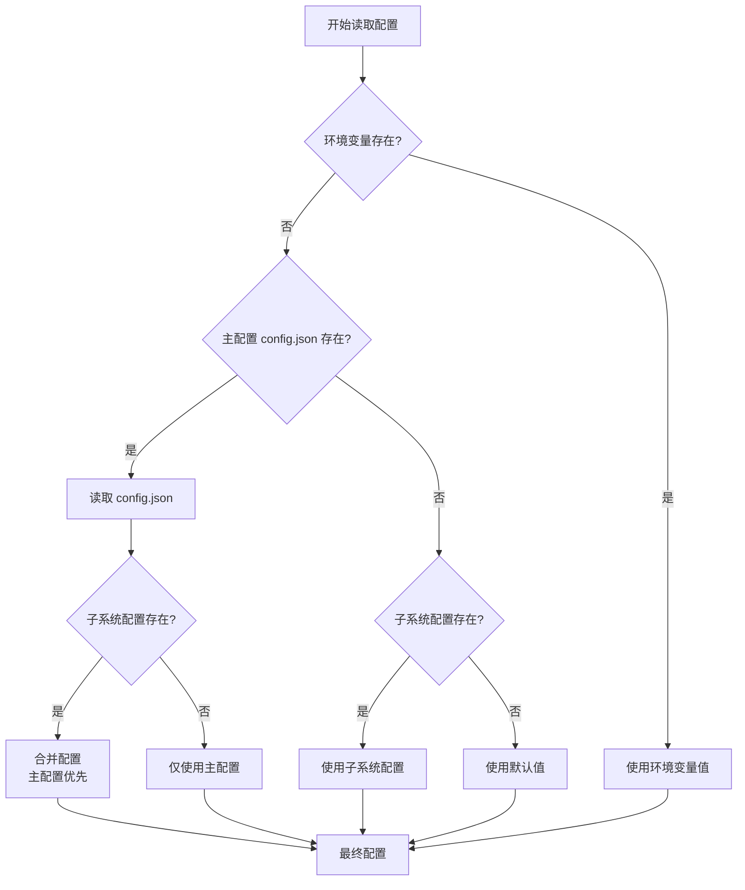

# xiaomiaoVirtual 配置指南

**版本**: v1.1  
**更新日期**: 2026-06-24

> 详细的配置说明和参数解释

**完整配置示例** → [config-examples.md](../06-examples/config-examples.md)

---

## 📋 目录

1. [配置文件位置](#配置文件位置)
2. [配置优先级](#配置优先级)
3. [主配置](#主配置)
4. [QQ Bot 配置](#qq-bot-配置)
5. [Agent 配置](#agent-配置)
6. [人设配置](#人设配置)
7. [安全配置](#安全配置)
8. [配置示例](#配置示例)
9. [常见配置错误](#常见配置错误)
10. [注意事项](#注意事项)

---

## 📁 配置文件位置

```
xiaomiaoVirtual/
├── config.json                    # 主配置（xiaomiaoAgent）
├── xiaomiao/config.json           # QQ Bot 配置
└── xiaomiaoAgent/.nanobot/config.json  # Agent 运行配置
```

---

## 🔄 配置优先级

### 优先级顺序



### 优先级说明

**从高到低**：
1. **环境变量** (最高优先级)
   - 例如：`NANOBOT_API_KEY`
   - 覆盖所有配置文件

2. **主配置文件** (`config.json`)
   - 项目根目录
   - 影响所有子系统

3. **子系统配置文件**
   - `xiaomiao/config.json` - QQ Bot 配置
   - `xiaomiaoAgent/.nanobot/config.json` - Agent 配置

4. **默认值** (最低优先级)
   - 代码中的硬编码默认值

### 配置继承规则

```
环境变量
    ↓ (覆盖)
主配置 config.json
    ↓ (继承 + 覆盖)
子系统配置
    ↓ (填充)
默认值
```

**示例**：

```bash
# 环境变量设置
export NANOBOT_API_KEY="sk-env-key"

# config.json
{
  "nanobot": {
    "model": "deepseek-v4-flash",
    "providers": {
      "custom": {
        "apiKey": "sk-config-key"  # 会被环境变量覆盖
      }
    }
  }
}

# 最终生效：NANOBOT_API_KEY = "sk-env-key"
```

### 配置合并策略

**对象合并**：
```json
// 主配置
{
  "nanobot": {
    "model": "deepseek-v4-flash",
    "temperature": 0.7
  }
}

// 子系统配置
{
  "nanobot": {
    "model": "gpt-4",  // 会被主配置覆盖
    "max_tokens": 2000  // 新增，不冲突
  }
}

// 合并结果
{
  "nanobot": {
    "model": "deepseek-v4-flash",  // 来自主配置
    "temperature": 0.7,             // 来自主配置
    "max_tokens": 2000              // 来自子系统
  }
}
```

---

## ⚙️ 主配置（config.json）

### 基本结构
```json
{
  "xiaomiao_agent": {
    "enabled": true,
    "base_url": "http://127.0.0.1:8900/v1/chat/completions",
    "model": "",
    "session_id": "xiaomiao-unified",
    "timeout_seconds": 30
  },
  "xiaomiaoAgent": {
    "model": "deepseek-v4-flash",
    "providers": {
      "custom": {
        "apiKey": "your-api-key",
        "baseUrl": "https://api.deepseek.com/v1"
      }
    },
    "provider": "custom"
  }
}
```

### 参数说明

#### xiaomiao_agent（QQ Bot → Agent 配置）
- `enabled`: 是否启用 Agent 后端
- `base_url`: Agent API 地址
- `model`: 覆盖模型（可选）
- `session_id`: 会话 ID（默认 xiaomiao-unified）
- `timeout_seconds`: 超时时间（0 = 无限等待）

#### xiaomiaoAgent（Agent 核心配置）
- `model`: 默认模型
- `provider`: 提供商（custom/anthropic/openai）
- `providers.custom`: 自定义提供商配置

---

## 🤖 QQ Bot 配置（xiaomiao/config.json）

### 完整结构
```json
{
  "ROOT": "你的QQ号",
  "Super": [],
  "agent_tool_allowlist": [],
  "owner": ["你的QQ号"],
  "black_list": [],
  "silents": [],
  "Connection": {
    "mode": "FWS",
    "host": "127.0.0.1",
    "port": 5004,
    "listener_host": "127.0.0.1",
    "listener_port": 5003
  },
  "Log_level": "DEBUG",
  "protocol": "OneBot",
  "Others": {
    "bot_name": "小喵",
    "reminder": "- ",
    "personas": {
      "senior_programmer": "高级程序员人设..."
    }
  }
}
```

### 权限配置

#### ROOT（最高权限）
```json
{
  "ROOT": "3554978979"
}
```
- 单个 QQ 号（字符串）
- 完整工具权限

#### Super（管理员）
```json
{
  "Super": ["QQ号1", "QQ号2"]
}
```
- 多个 QQ 号（数组）
- 完整工具权限

#### agent_tool_allowlist（白名单）
```json
{
  "agent_tool_allowlist": ["QQ号3", "QQ号4"]
}
```
- 多个 QQ 号（数组）
- 完整工具权限

### 连接配置

#### NapCat 连接
```json
{
  "Connection": {
    "mode": "FWS",              // 正向 WebSocket
    "host": "127.0.0.1",        // NapCat 地址
    "port": 5004,               // NapCat WebSocket 端口
    "listener_host": "127.0.0.1",
    "listener_port": 5003       // HTTP 回调端口
  }
}
```

### 其他配置

#### Bot 基本信息
```json
{
  "Others": {
    "bot_name": "小喵",         // Bot 名称
    "bot_name_en": "XiaoMiao",  // 英文名
    "reminder": "- "            // 命令前缀
  }
}
```

#### 人设配置
```json
{
  "personas": {
    "senior_programmer": "你叫{bot_name}，是{event_user}的高级程序员助手...",
    "girl_friend": "你叫{bot_name}，是{event_user}的女朋友...",
    "sister": "你叫{bot_name}，是{event_user}的姐姐...",
    "mother": "你叫{bot_name}，是{event_user}的妈妈..."
  }
}
```

---

## 🔧 Agent 配置（.nanobot/config.json）

### 基本配置
```json
{
  "model": "deepseek-chat",
  "provider": "custom",
  "providers": {
    "custom": {
      "apiKey": "sk-xxx",
      "baseUrl": "https://api.deepseek.com/v1"
    },
    "anthropic": {
      "apiKey": "sk-ant-xxx"
    },
    "openai": {
      "apiKey": "sk-xxx"
    }
  }
}
```

### 工具配置
```json
{
  "tools": {
    "exec": {
      "enabled": true
    },
    "web_search": {
      "enabled": true,
      "provider": "brave"
    }
  }
}
```

### MCP 配置
```json
{
  "mcp": {
    "servers": {
      "filesystem": {
        "command": "npx",
        "args": ["-y", "@modelcontextprotocol/server-filesystem"]
      }
    }
  }
}
```

---

## 🎨 人设配置

### 人设变量
```
{bot_name}      - Bot 名称
{bot_name_en}   - Bot 英文名
{event_user}    - 用户昵称
```

### 自定义人设
```json
{
  "personas": {
    "my_persona": "你叫{bot_name}，是一个...（人设描述）"
  }
}
```

### 人设切换规则
- 默认：`senior_programmer`
- 特定用户：在配置中指定映射

---

## 🔐 安全配置

### 黑名单
```json
{
  "black_list": ["恶意QQ号"]
}
```

### 静默名单
```json
{
  "silents": ["不响应的QQ号"]
}
```

### 自动审批
```json
{
  "Auto_approval": ["自动同意好友请求的QQ号"]
}
```

---

## 📊 配置示例

### 开发环境
```json
{
  "ROOT": "你的QQ号",
  "Log_level": "DEBUG",
  "Others": {
    "bot_name": "小喵Dev",
    "reminder": "dev-"
  }
}
```

### 生产环境
```json
{
  "ROOT": "管理员",
  "Super": ["副管理1", "副管理2"],
  "Log_level": "INFO",
  "Others": {
    "bot_name": "小喵",
    "reminder": "- "
  }
}
```

### 测试环境
```json
{
  "ROOT": "",
  "agent_tool_allowlist": ["测试账号"],
  "Log_level": "DEBUG"
}
```

---

## ❌ 常见配置错误

### 错误 1: API Key 格式错误

**症状**：
```
❌ Error: Unauthorized (401)
❌ Invalid API Key
```

**错误配置**：
```json
{
  "nanobot": {
    "providers": {
      "custom": {
        "apiKey": "your-api-key"  // ❌ 占位符未替换
      }
    }
  }
}
```

**正确配置**：
```json
{
  "nanobot": {
    "providers": {
      "custom": {
        "apiKey": "sk-abc123..."  // ✅ 真实的 API Key
      }
    }
  }
}
```

**解决方案**：
1. 检查 API Key 是否正确复制
2. 确认 API Key 未过期
3. 验证 API Key 权限
4. 使用环境变量存储敏感信息

---

### 错误 2: 端口配置冲突

**症状**：
```
❌ Error: Address already in use
❌ Port 8900 is already in use
```

**错误原因**：
- 服务重复启动
- 其他程序占用端口
- 配置中端口号重复

**检查命令**：
```powershell
# 检查端口占用
netstat -ano | findstr "8900"

# 查看进程
tasklist | findstr "PID号"

# 结束进程
taskkill /PID <进程ID> /F
```

**解决方案**：
1. 检查是否有服务重复运行
2. 更换端口号
3. 关闭占用端口的程序

---

### 错误 3: JSON 格式错误

**症状**：
```
❌ JSONDecodeError: Expecting property name enclosed in double quotes
❌ Invalid JSON format
```

**常见错误**：
```json
{
  "nanobot": {
    "model": "deepseek-v4-flash",  // ❌ 不允许注释
    "temperature": 0.7,            // ❌ 不允许注释
  }  // ❌ 最后一个元素后多了逗号
}
```

**正确格式**：
```json
{
  "nanobot": {
    "model": "deepseek-v4-flash",
    "temperature": 0.7
  }
}
```

**验证工具**：
- 在线：https://jsonlint.com/
- 命令行：`python -m json.tool config.json`
- VSCode：安装 JSON 格式化插件

---

### 错误 4: 路径配置错误

**症状**：
```
❌ FileNotFoundError: No such file or directory
❌ Config file not found
```

**错误配置**：
```json
{
  "config_path": "xiaomiaoAgent/config.json"  // ❌ 相对路径可能错误
}
```

**正确配置**：
```json
{
  "config_path": "F:/xiaomiaoVirtual/xiaomiaoAgent/.nanobot/config.json"  // ✅ 绝对路径
}
```

**建议**：
- 使用绝对路径
- 检查文件是否存在
- 注意 Windows 路径分隔符（`/` 或 `\`）

---

### 错误 5: 权限配置混淆

**症状**：
```
❌ Permission denied
❌ 工具调用被拒绝
```

**错误理解**：
```json
{
  "ROOT": ["123456789"]  // ❌ ROOT 应该是字符串，不是数组
}
```

**正确配置**：
```json
{
  "ROOT": "123456789",           // ✅ 单个 QQ 号（字符串）
  "Super": ["987654321"],        // ✅ 多个 QQ 号（数组）
  "agent_tool_allowlist": []     // ✅ 多个 QQ 号（数组）
}
```

**权限层级**：
```
ROOT (最高) > Super > agent_tool_allowlist > 普通用户
```

---

### 错误 6: 模型名称错误

**症状**：
```
❌ Model not found
❌ Invalid model name
```

**错误配置**：
```json
{
  "nanobot": {
    "model": "deepseek-v4"  // ❌ 模型名不完整
  }
}
```

**正确配置**：
```json
{
  "nanobot": {
    "model": "deepseek-v4-flash"  // ✅ 完整的模型名
  }
}
```

**常用模型名**：
- `deepseek-v4-flash` - DeepSeek V4 Flash
- `deepseek-chat` - DeepSeek Chat
- `gpt-4` - OpenAI GPT-4
- `gpt-3.5-turbo` - OpenAI GPT-3.5

---

### 错误 7: WebSocket 连接失败

**症状**：
```
❌ WebSocket connection failed
❌ Connection refused
```

**检查清单**：
1. NapCat 是否启动
   ```powershell
   netstat -ano | findstr "5004"
   ```

2. 端口配置是否正确
   ```json
   {
     "Connection": {
       "host": "127.0.0.1",  // 检查地址
       "port": 5004          // 检查端口
     }
   }
   ```

3. 防火墙设置
   - 允许本地连接
   - 检查安全软件拦截

4. 代理设置
   ```powershell
   # 设置不使用代理
   set NO_PROXY=127.0.0.1,localhost
   ```

---

### 错误 8: 配置未生效

**症状**：
- 修改配置后没有变化
- 服务使用旧配置

**原因**：
- 未重启服务
- 修改了错误的配置文件
- 配置被环境变量覆盖

**解决方案**：
1. 确认修改了正确的配置文件
   ```powershell
   # 查看文件修改时间
   ls -l config.json
   ```

2. 重启所有相关服务
   ```powershell
   # 停止服务
   Ctrl+C

   # 重新启动
   pnpm run start:all
   ```

3. 检查环境变量
   ```powershell
   # 查看环境变量
   echo $env:NANOBOT_API_KEY
   ```

4. 清除缓存
   ```powershell
   # 清理 Python 缓存
   rm -rf __pycache__
   rm -rf .pytest_cache
   ```

---

### 错误 9: 会话 ID 冲突

**症状**：
- 不同用户看到相同的聊天历史
- 会话混乱

**错误配置**：
```json
{
  "nanobot_agent": {
    "session_id": "default"  // ❌ 所有人共用一个会话
  }
}
```

**正确配置**：
```json
{
  "nanobot_agent": {
    "session_id": "xiaomiao-unified"  // ✅ 使用统一会话 ID
  }
}
```

**建议**：
- 生产环境：使用固定的会话 ID（如 `xiaomiao-unified`）
- 测试环境：使用临时会话 ID（如 `test-{timestamp}`）
- 多用户：动态生成会话 ID（如 `user-{qq_id}`）

---

### 错误 10: 超时配置不当

**症状**：
- 请求频繁超时
- 响应时间过长

**错误配置**：
```json
{
  "nanobot_agent": {
    "timeout_seconds": 5  // ❌ 超时时间过短
  }
}
```

**正确配置**：
```json
{
  "nanobot_agent": {
    "timeout_seconds": 30  // ✅ 合理的超时时间
  }
}
```

**推荐值**：
- 快速响应：10-15 秒
- 一般场景：30 秒
- 复杂任务：60-120 秒
- 长时间任务：使用异步模式

---

## ⚠️ 注意事项

### 配置修改后
1. ✅ 重启服务生效
2. ✅ 备份配置文件
3. ✅ 检查 JSON 格式

### 敏感信息
- ⚠️ 不要提交 API Key 到 Git
- ⚠️ 使用环境变量存储密钥
- ⚠️ 定期更换 API Key

---

## 📚 相关文档

- [快速开始](QUICK_START.md) - 基本配置
- [配置示例](../06-examples/config-examples.md) - 完整配置示例
- [QQ Bot 指南](QQ_BOT_GUIDE.md) - 权限配置
- [故障排查](../01-configuration/troubleshooting.md) - 配置问题

---

## 🔄 版本历史

| 版本 | 日期 | 变更 |
|------|------|------|
| v1.1 | 2026-06-24 | 添加配置优先级图、常见配置错误 |
| v1.0 | 2024-06-13 | 初始版本 |

---

**需要帮助？** 查看 [故障排查文档](../01-configuration/troubleshooting.md) 或提 Issue。
