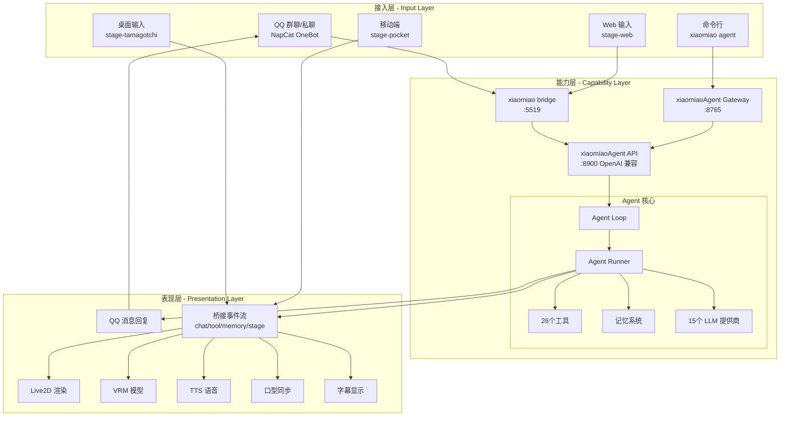

# xiaomiaoVirtual 项目架构总览

> **生成日期**: 2026-06-13  
> **版本**: v1.0  
> **基于**: 深度代码探索和文档分析

---

## 📊 项目概览

**xiaomiaoVirtual** 是一个融合 QQ 机器人、Vtuber 表现层和轻量 Agent 框架的多端虚拟角色项目。项目采用**三层架构**设计，实现了从 QQ 群聊、Web 端、桌面端到移动端的全链路 Agent 能力整合。

### 核心特点
- 🤖 **统一 Agent 能力层**：所有端共享同一个 Agent 会话
- 🎭 **多端表现层**：Web、桌面（Electron）、移动（Capacitor）
- 🔗 **桥接协议**：统一的事件流和消息传递机制
- 🧠 **记忆系统**：Dream 两阶段记忆整合
- 🛡️ **安全策略**：分级工具权限和确认机制

---

## 🏗️ 三层架构



---

## 🎯 三大子系统

### 1. xiaomiao - QQ 桥接服务

**职责**: 连接 QQ 生态，提供消息处理和工具权限网关

**技术栈**: Python + NapCat + OneBot

**核心模块**:
- `main.py` - 事件监听、命令解析、AI 回复
- `agent_backend.py` - 统一 Agent 后端调用
- `desktop_bridge.py` - 桥接服务 (:5519)
- `qq_permissions.py` - ROOT/Super/白名单权限
- `qq_agent_tools.py` - 工具策略与确认码
- `qq_workspace.py` - 文件下载与转换

**关键能力**:
- QQ 消息接入（群聊/私聊）
- 权限分级（普通用户 low_risk，白名单需二次确认）
- 人设切换（女朋友/姐姐/妈妈/高级程序员）
- 图片理解与生成
- 群文件下载与文档转换
- OpenAI 兼容桥接服务

**端口**: 5519 (桥接服务), 5004 (NapCat)

**代码位置**: `xiaomiao/`

---

### 2. xiaomiaoAgent - Agent 能力层

**职责**: 提供统一的 AI Agent 能力，支持多平台通道和工具系统

**技术栈**: Python + nanobot + 多种 LLM SDK

**内部包名**: `nanobot` (上游开源项目)

**核心架构**:

```
nanobot/
├── agent/              # Agent 核心
│   ├── loop.py         # 主循环
│   ├── runner.py       # LLM 对话运行器
│   ├── memory.py       # Dream 记忆系统
│   └── tools/          # 26个工具
├── channels/           # 18个通道（Telegram/Discord/QQ/微信等）
├── providers/          # 15个 LLM 提供商
├── session/            # 会话管理
├── config/             # 配置系统
├── cli/                # CLI 命令
└── api/                # OpenAI 兼容 API
```

**工具系统** (26个):
- **文件系统**: filesystem (读/写/编辑/列表)
- **命令执行**: shell (沙箱)
- **Web 能力**: search, web (抓取)
- **MCP 集成**: mcp (Model Context Protocol)
- **调度**: cron (定时任务)
- **Notebook**: notebook (Jupyter 编辑)
- **子 Agent**: spawn (生成子 Agent)
- **自定义**: MyTool (自我修改)
- **交互**: ask (用户确认)
- **图像**: image_generation
- **xiaomiaoVirtual 专用**: xiaomiaobot_services, xiaomiao_stage, markitdown_tool, scrapling_tool

**通道支持** (18个):
- Telegram, Discord, Slack
- 飞书/Lark, 钉钉
- QQ, 微信, 企业微信
- WhatsApp, Matrix, MS Teams
- Email, WebSocket

**LLM 提供商** (15个):
- Anthropic Claude
- OpenAI (含兼容接口)
- Azure OpenAI
- GitHub Copilot
- AWS Bedrock
- 其他 OpenAI 兼容

**端口**:
- 8900 - OpenAI 兼容 API
- 8765 - Gateway (WebSocket)
- 5174 - WebUI

**测试**: 180 个测试文件

**文档**: 16 个完整文档

**代码位置**: `xiaomiaoAgent/nanobot/`

---

### 3. xiaomiaobot - Web/桌面/移动表现层

**职责**: 提供多端 Vtuber 表现层，支持 Live2D/VRM 渲染、TTS、口型同步

**技术栈**: TypeScript + Vue 3 + Electron + Capacitor + pnpm monorepo

**内部包名**: `@proj-airi/*` (上游 AIRI 项目)

**Monorepo 结构**:

```
xiaomiaobot/
├── apps/               # 6个应用
│   ├── stage-web       # Web 端 Vtuber
│   ├── stage-tamagotchi # 桌面端 (Electron)
│   ├── stage-pocket    # 移动端 (Capacitor)
│   ├── server          # Hono 后端服务
│   ├── component-calling
│   └── ui-server-auth
│
└── packages/           # 45个包
    ├── stage-ui        # ⭐ 核心舞台组件
    ├── stage-ui-live2d # Live2D 组件
    ├── stage-ui-three  # VRM/Three.js
    ├── stage-layouts   # 布局与桥接客户端
    ├── core-agent      # Agent 运行时编排
    ├── core-character  # 角色管道编排
    ├── model-driver-lipsync # 口型同步
    ├── ui              # 基础组件库
    ├── server-runtime  # 服务器运行时
    └── ... (40+ 其他包)
```

**关键功能**:

**stage-web** (Web 端):
- Vue 3 + Vite
- 文本/语音输入
- 桥接客户端 (`xiaomiao-bridge.ts`)
- Live2D/VRM 渲染
- TTS 播报

**stage-tamagotchi** (桌面端):
- Electron 41.2.1
- 主进程：IPC、窗口管理
- 渲染进程：Vue 页面、桥接轮询
- 桥接模块：
  - `xiaomiao-bridge.ts` - 读取 `/v1/xiaomiao/state`
  - `xiaomiao-bridge-reaction.ts` - 分发到字幕/聊天/语音/口型
  - `chat-sync.ts` - 聊天同步
- Live2D 口型同步
- TTS 播报

**stage-pocket** (移动端):
- Capacitor 8.3.1 (iOS + Android)
- 只读同步桥接事件
- 原生能力集成

**server** (后端):
- Hono + Better Auth + Drizzle ORM
- PostgreSQL + Redis
- Stateless 多实例部署
- LLM 网关代理

**端口**:
- 5175 - stage-web
- 3000 - server

**测试**: 765 个测试文件，845 tests passed

**文档**: 2289+ 个文档（含 VitePress 多语言站）

**代码位置**: `xiaomiaobot/`

---

## 🔗 统一 Agent 链路

### 消息流向

```
┌─────────────────────────────────────────────────────────────┐
│                        用户输入                              │
│  QQ 消息 / Web 输入 / 桌面输入 / CLI 命令                   │
└─────────────────┬───────────────────────────────────────────┘
                  │
                  ▼
┌─────────────────────────────────────────────────────────────┐
│                      接入层路由                              │
│  • QQ → xiaomiao main.py                                    │
│  • Web/Desktop → xiaomiao desktop_bridge.py                 │
│  • CLI → xiaomiaoAgent gateway                              │
└─────────────────┬───────────────────────────────────────────┘
                  │
                  ▼
┌─────────────────────────────────────────────────────────────┐
│                 xiaomiaoAgent API :8900                      │
│       POST /v1/chat/completions                             │
│       session_id: xiaomiao-unified                          │
└─────────────────┬───────────────────────────────────────────┘
                  │
                  ▼
┌─────────────────────────────────────────────────────────────┐
│                    Agent Loop                                │
│  1. 读取会话历史                                             │
│  2. 构建上下文                                               │
│  3. 调用 LLM                                                │
│  4. 执行工具                                                │
│  5. 更新记忆                                                │
└─────────────────┬───────────────────────────────────────────┘
                  │
                  ▼
┌─────────────────────────────────────────────────────────────┐
│                      输出分发                                │
│  • QQ 回复 → NapCat                                         │
│  • 桥接事件 → desktop_bridge :5519                          │
│    - chat: 聊天消息                                          │
│    - tool: 工具调用                                          │
│    - confirmation: 需要确认                                   │
│    - memory: 记忆更新                                        │
│    - stage: 舞台动作                                         │
└─────────────────┬───────────────────────────────────────────┘
                  │
                  ▼
┌─────────────────────────────────────────────────────────────┐
│                    表现层渲染                                │
│  • stage-tamagotchi 轮询桥接事件                            │
│  • 分发到字幕/聊天/TTS/口型同步                             │
│  • Live2D/VRM 驱动嘴部                                       │
│  • stage-pocket 只读展示                                    │
└─────────────────────────────────────────────────────────────┘
```

### 关键设计决策

**统一会话 ID**: `xiaomiao-unified`
- 所有入口共享同一个 Agent 会话
- 避免上下文分裂
- 记忆在所有端同步

**桥接事件协议**:
- JSONL 格式存储 (`workspace/tmp/bridge_events.jsonl`)
- 事件类型：chat/tool/confirmation/memory/stage
- 轮询机制：`/v1/xiaomiao/events?after=<id>`
- 增量读取，避免重复处理

**工具权限分级**:
- 普通 QQ 用户：仅 `low_risk` 工具
- 白名单用户：需二次确认（确认码机制）
- ROOT/Super：全部权限

---

## 🔌 端口和服务依赖

| 端口 | 服务 | 职责 | 依赖 |
|------|------|------|------|
| **5004** | NapCat OneBot | QQ 协议适配 | QQ 账号登录 |
| **5519** | xiaomiao bridge | 桥接服务 | xiaomiaoAgent API :8900 |
| **8900** | xiaomiaoAgent API | OpenAI 兼容 API | LLM 提供商 API |
| **8765** | xiaomiaoAgent Gateway | WebSocket 网关 | xiaomiaoAgent API :8900 |
| **5175** | stage-web | Web 端 Vtuber | xiaomiao bridge :5519 |
| **5174** | xiaomiaoAgent WebUI | React 前端 | xiaomiaoAgent Gateway :8765 |
| **3000** | xiaomiaobot server | Hono 后端 | PostgreSQL, Redis |

**启动顺序**:
1. NapCat (:5004)
2. xiaomiaoAgent API (:8900)
3. xiaomiaoAgent Gateway (:8765) [可选]
4. xiaomiao bridge (:5519)
5. stage-web (:5175) [可选]
6. xiaomiaoAgent WebUI (:5174) [可选]

**最小运行**:
```
NapCat + xiaomiaoAgent API + xiaomiao bridge
```

**完整体验**:
```
上述 + stage-web/tamagotchi + xiaomiaoAgent WebUI
```

---

## 💾 数据流和存储

### 配置文件

| 文件 | 职责 | 提交 |
|------|------|------|
| `config.json` | 主目录统一配置（模型、Agent） | ❌ 本地私有 |
| `config.example.json` | 配置模板 | ✅ 提交 |
| `xiaomiao/config.json` | QQ Bot 配置（OneBot、人设） | ❌ 本地私有 |
| `xiaomiaoAgent/.nanobot/config.json` | Agent 配置 | ❌ 本地私有 |

### 工作区

```
workspace/
├── downloads/qq/       # QQ 群文件下载
├── artifacts/          # Agent 生成物
└── tmp/
    └── bridge_events.jsonl  # 桥接事件存储
```

**.gitignore**: 工作区不提交，只保留目录骨架

### 会话和记忆

**xiaomiaoAgent**:
- `~/.nanobot/workspace/sessions/` - 会话历史
- `~/.nanobot/workspace/memory/` - 长期记忆
- Dream 两阶段记忆整理

**xiaomiaobot**:
- `memory-pgvector` 包 - 向量记忆存储（可选）

---

## 🧰 技术栈汇总

### 后端 (Python)

| 子系统 | 核心技术 | 主要依赖 |
|--------|---------|---------|
| **xiaomiao** | Python 3.13 | NapCat, OneBot, requests |
| **xiaomiaoAgent** | Python 3.11+ | anthropic>=0.45, openai>=2.8, mcp>=1.26, python-telegram-bot, discord.py, qq-botpy |

### 前端 (TypeScript)

| 子系统 | 核心技术 | 主要依赖 |
|--------|---------|---------|
| **xiaomiaobot** | Vue 3, TypeScript, Vite | Electron 41, Capacitor 8, Hono, Pinia, UnoCSS, reka-ui |

### 基础设施

- **包管理**: Python (uv/pip), Node.js (pnpm)
- **构建**: Vite, electron-vite, tsdown, Turborepo
- **测试**: pytest (Python), Vitest (TypeScript)
- **Lint**: Ruff (Python), ESLint + oxlint (TypeScript)
- **类型**: mypy (Python), TypeScript
- **CI/CD**: 待添加 GitHub Actions

---

## 🔒 安全边界

### 网络安全
- **本地监听**: 所有服务默认绑定 `127.0.0.1`
- **跨设备访问**: 需手动配置 + 增加鉴权
- **网页抓取**: 阻断本机和内网地址 (`security/network.py`)

### 工具权限
- **普通用户**: `low_risk` 工具（搜索、抓取、文档转换）
- **白名单用户**: 高风险需二次确认（Shell、文件写入、MCP）
- **ROOT 用户**: 全部权限

### 文件安全
- **QQ 下载**: 自动存储到 `workspace/downloads/qq/`
- **文件类型**: 白名单验证（扩展名 + MIME）
- **路径遍历**: 禁止 `../` 等路径操作

### MCP 安全
- **配置档**: 限制 MCP 服务器权限（Computer Use、Twitter 等）
- **工具策略**: 按服务器分级控制

---

## 📈 项目规模

| 指标 | 数值 |
|------|------|
| **子系统数** | 3 (xiaomiao + xiaomiaoAgent + xiaomiaobot) |
| **Python 代码** | ~50K+ 行 |
| **TypeScript 代码** | ~100K+ 行 |
| **文档总数** | 2336+ 个 Markdown |
| **测试文件数** | 955+ (Python 190 + TypeScript 765) |
| **npm 包数** | 51 (6 apps + 45 packages) |
| **Python 工具数** | 26 |
| **LLM 提供商** | 15 |
| **通道支持** | 18 |

---

## 🔄 演进路线

### 已完成 ✅
- 统一 Agent 链路（所有端 → xiaomiaoAgent）
- QQ Agent 工具权限网关
- 低风险工具（markitdown, scrapling）
- MCP 安全配置档
- 桥接事件同步（chat/tool/memory/stage）
- Live2D 口型同步
- stage-pocket 移动端
- 一键启动脚本

### 待推进 🔄
- 图片理解迁移到 xiaomiaoAgent
- 桥接配置动态化
- 待产品化服务（HomeAssistant、Bilibili、Chess等）
- 记忆体系评估
- Python Bot 单体拆分

---

## 📚 相关文档

- [文档总索引](DOCUMENTATION_INDEX.md) - 快速导航
- [文档分类树](DOCUMENTATION_TREE.md) - 完整文档分类
- [测试覆盖矩阵](TEST_COVERAGE_MATRIX.md) - 测试统计
- [项目检查报告](PROJECT_CHECK_REPORT_2026-06-13.md) - 质量评估

---

**维护**: 本文档随架构演进定期更新
